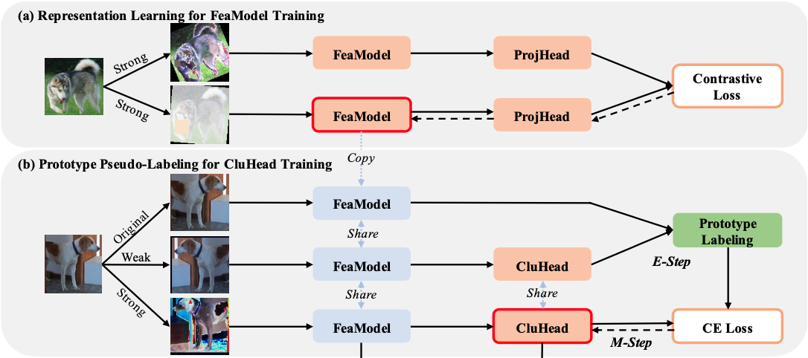

# 3rd phase for SPICE: spice training

<tr>
<td></td>
</tr>

In the previous phase we trained the self-supervised model (MoCo) in order to have an Encoder capable to extract features of images (a)
In this phase we have to train the SPICE model for image clustering (b). 
SPICE model is composed with the Encoder with pretrained weights (from the previous phase) and a Clustering Head which is composed of several Clustering Heads which are Multi-Layer Perceptrons (MLPs).

The workflow of this phase is the following:
- Expectation (E) step
    - first branch takes original images and extract features from them
    - second branch takes weakly augmented images, extract features and obtain the probability of every image to belong a cluster (score), using a softmax
    - features of original images and probabilites of weakly agumented are used to create a prototype labeling: 
        - using probabilities, the best scores are selected for every cluster and so the features of the relative orginal images are used as cluster center (if there are more images, mean is computed obtaining a unique feature)
        - using clustering centers, cosine similarity is computed with other images to get which images belong to a certain cluster --> prototype labels (ground truth)
    - This step is a non training step --> SPICE model is not trained

- Maximization (M) step
    - The clustering Head is trained using strongly augmented images as samples and prototype labels extracted in the previous phase as ground truth
    - This step is reiterated multiple times per batch_size (see arguments of train_spice.py script)

## Script
train_spice.py

## Description
Implements the just described phase

## Arguments
### Script arguments
- config file: the location of the config file (see Config file arguments)
- dataset_folder: location of the dataset
- pretrained_self_supervised_model: location of the saved self-supervised trained model
- resume: location to the saved spice training checkpoint
- save_folder: location where to save spice training checkpoints
- logs_folder: location where to save tensorboard logs
- save-freq: how many epochs the training is saved, evaluation is performed and plots are updated
- epochs: how many epochs the model will be trained
- start-epoch: from which epoch to start
- lr: learning rate used for the clustering head training

### Config file arguments
- batch_size: the size of the batch used every iteration if the training of the Clustering Head 
- target_sub_batch_size: batch size used to get 